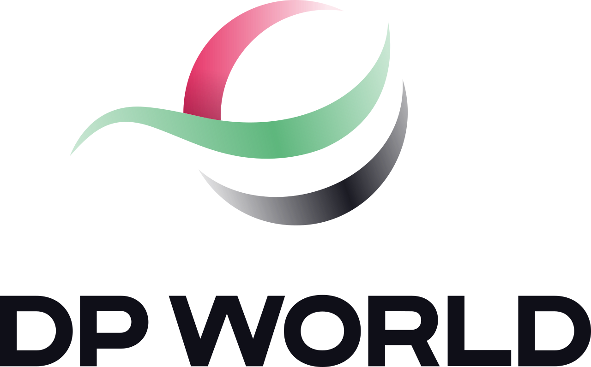
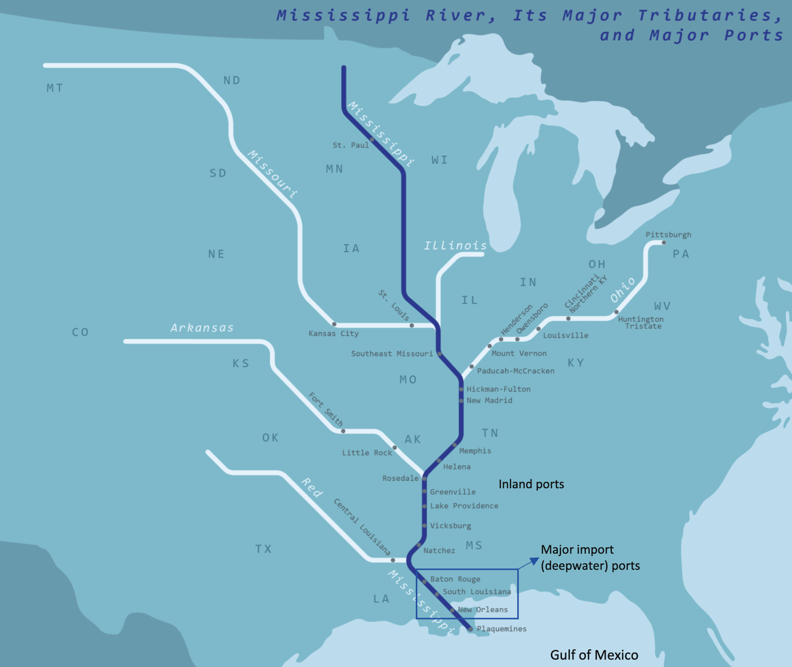
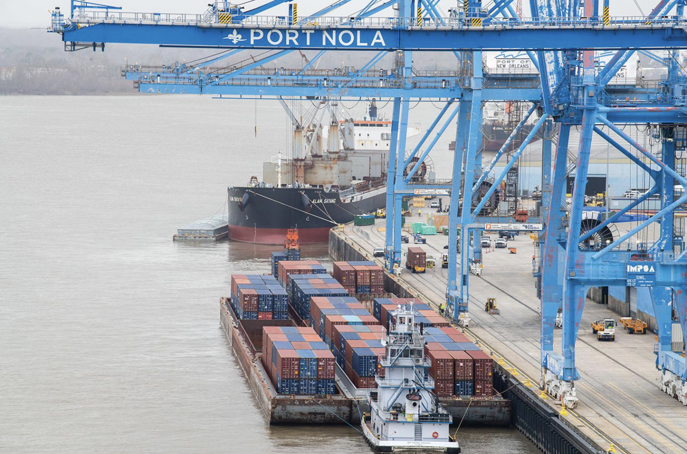
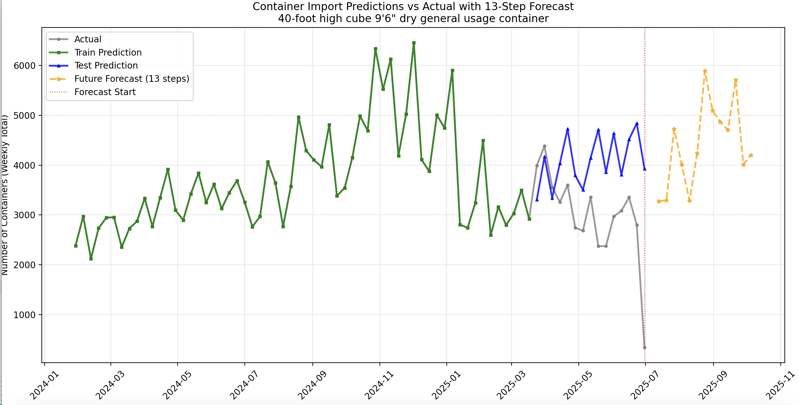
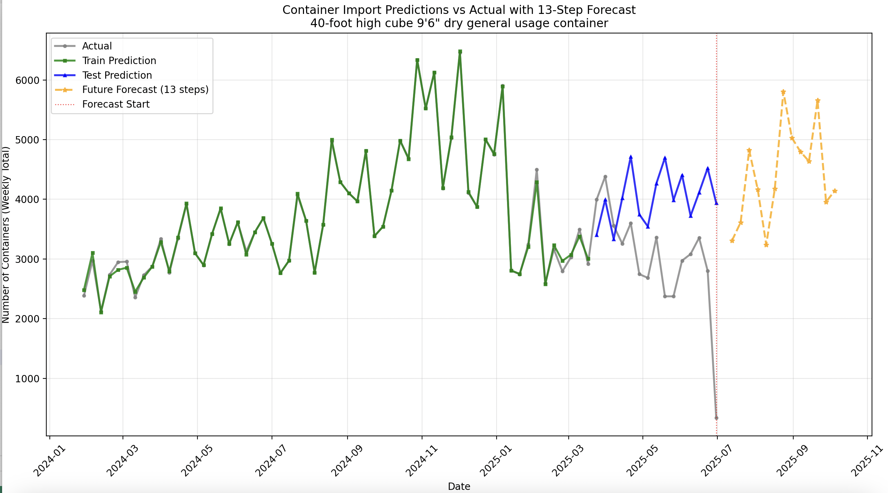
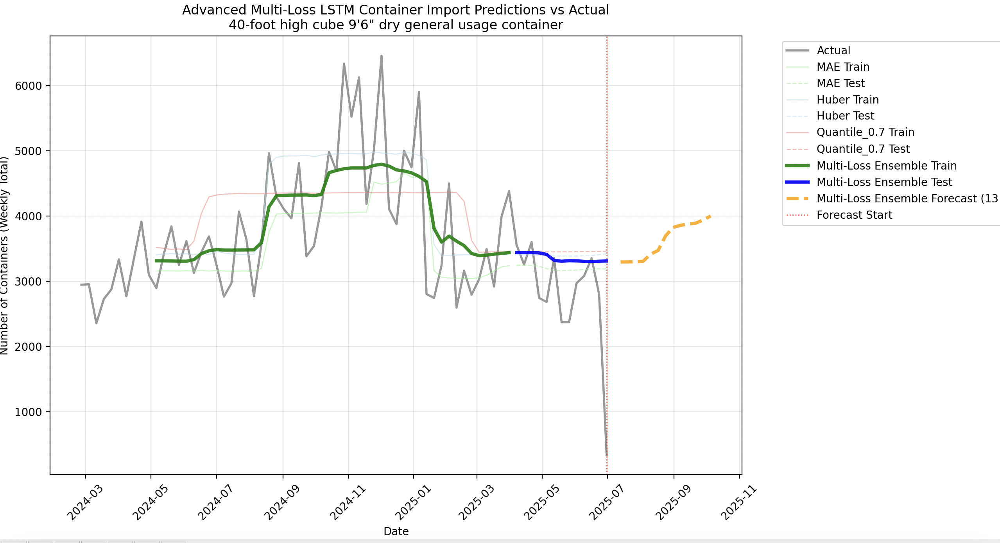

<h1 align="center">Mississippi Waterway Optimization</h1>
<h1 align="center">A Strategic Barge Forecasting & Optimization Project</h1>

<p align="center">
    
    
</p>

This repository contains the code, data analysis, and strategic recommendations for a project focused on modernizing U.S. waterway logistics, with a specific focus on the Mississippi River system. The project was prepared for **DP World** in collaboration with the **MIT Center for Transportation & Logistics**.

## Table of Contents

- [Project Introduction](#1-project-introduction)
- [Problem Statement](#2-problem-statement)
- [Data Analysis and Preprocessing](#3-data-analysis-and-preprocessing)
- [Forecasting Models](#4-forecasting-models)
- [Strategic Implications and Recommendations](#5-strategic-implications-and-recommendations)
- [Repository Structure](#6-repository-structure)

-----

## 1\. Project Introduction

The Mississippi River system is a critical artery for U.S. commerce, spanning 12,350 miles and connecting 31 states. In 2019, inland waterways moved 514.9 million tons of domestic commerce, with the Mississippi River alone accounting for 60% of all U.S. grain exports and transporting over 175 million tons of freight annually, valued at over $70 billion.

The primary goal of this project is to forecast the demand for the number of containers on this waterway and to explore a strategic plan for a more efficient, waterway-dominant transportation mode.

<p align="center">
    <br>
    <span>Mississippi River</span>
</p>

-----

## 2\. Problem Statement

The current reliance on trucking for freight transportation between New Orleans and Chicago presents several significant challenges for DP World, including severe road congestion, environmental pollution, load weight restrictions, and high transportation costs.

The existing lead time for this route via barge is an estimated 21 days with an average cost of **$2,100**. DP World is exploring the feasibility of a waterway-dominant solution to drastically reduce the lead time to just **7 days** while maintaining competitive costs.

<p align="center">
    <br>
    <span>Barge Port</span>
</p>

-----

## 3\. Data Analysis and Preprocessing

The project utilized a time-series dataset that includes a variety of features to predict container demand. The data processing steps were crucial for preparing the raw data for model training.

### Data Features

Key features used in the forecasting models include:

  * **Time Series Features**: Trend, seasonality, and time lags.
  * **Product Information**: Declared shipment weight (`shippingWeightKg`) and product type, determined by the predicted HS code (`predicted_hscode`).
  * **Logistics Data**: Sea distance from the last foreign port to the first U.S. port (`sea_distance_km`).
  * **Environmental Data**: Weather conditions like maximum and minimum temperature (`TMAX`, `TMIN`), and various drought indices (`PDSI`, `PHDI`, `ZNDX`) to account for seasonal waterway risks.

### Preprocessing Pipeline

The `data_processing.ipynb` and `create_forecast_final.py` files detail the preprocessing steps, which include:

  * **Data Aggregation**: Combining data points from various sources.
  * **Imputation and Normalization**: Filling missing values and scaling data for consistent input.
  * **Feature Engineering**: Creating new features from the raw data.
  * **Container Type Mapping**: A function to map container codes to human-readable descriptions (e.g., '40-foot standard reefer container').

-----

## 4\. Forecasting Models

Two primary forecasting approaches were developed to predict container demand.

### Classical Machine Learning Models

The `create_forecast_final.py` script implements traditional machine learning models for forecasting. It uses a `DeterministicProcess` and `CalendarFourier` to capture time-series patterns and trains several models, including:

  * **Linear Regression**
  * **Random Forest Regressor**
  * **XGBoost Regressor**
  * **LSTM**


### Advanced Deep Learning Model

The `create_forecast_lstm_advanced.py` script utilizes a more sophisticated deep learning approach with **TensorFlow** and **Keras**. The model architecture is a `Bidirectional LSTM`, which is well-suited for sequence prediction tasks like time-series forecasting. The script also includes advanced features such as:

  * **Custom Loss Functions**: `quantile_loss`, `huber_loss_custom`, and `asymmetric_loss` to handle different types of prediction errors and provide more robust results against outliers.
  * **Early Stopping**: A callback to prevent overfitting during training.

-----

## 5\. Model Evaluation / Inferences

Below are our **evaluations on our models' ability** to **forecast the demand of containers** into the **next three months**. 

### 1. Hybrid Model (Linear Regression + XGBoost)

<p align="center">
    <br>
    <span>Mississippi River</span>
</p>

### 2. Hybrid Model (Linear Regression + RandomForest)

<p align="center">
    <br>
    <span>Mississippi River</span>
</p>

### 3. LSTM (With TensorFlow)

<p align="center">
    <br>
    <span>Mississippi River</span>
</p>

-----

## 6\. Strategic Implications and Recommendations

The project's findings provide a roadmap for DP World to implement a more efficient waterway-based logistics strategy.

### Port Infrastructure

An assessment of the ports in New Orleans and Chicago revealed key bottlenecks and strengths:

  * **New Orleans**: Acts as a gateway to the Mississippi River but is susceptible to hurricane outages, which can cause delays of 7+ days per year.
  * **Chicago**: Functions as a multimodal hub but is vulnerable to winter ice from December to February.

Strategic recommendations include modernization roadmaps for both ports to address these bottlenecks:

  * **New Orleans**: Louisiana Int'l Terminal upgrades (2025-2028) to add 1M TEU capacity and 30% faster loading through automation, reducing dwell time.
  * **Chicago**: Calumet Modernization (2024-2026) to add refrigerated plugs and improve barge clearance, which is projected to increase winter throughput by 40%.

### Lock and Dam System

The Illinois Waterway, a key part of the route from the Mississippi to Chicago, requires barges to navigate 8 locks and dams. Delays at these locks, combined with processing time, can add 22.5 to 32.5 hours to the journey.

### Risk Assessment

Seasonal risks, such as **drought** (low-water) and **floods** (high-water) in the Lower Mississippi, and **freeze** (ice) in the Illinois Waterway, can impact transit times. The project recommends intermodal alternatives like **rail** or **trucking** during these high-risk periods to maintain efficiency.

-----

## 6\. Repository Structure

```
Mississippi-Waterway-Optimisation/
├── create_forecast_final.py           # Python script for classical ML forecasting
├── create_forecast_lstm_advanced.py   # Python script for LSTM deep learning model
├── data_processing.ipynb              # Jupyter notebook for data preprocessing and exploration
├── final-presentation/
│   ├── richard-hanshen-zhuoling.pdf   # Final presentation on data and model analysis
│   └── siyu-zixuan-kaying.pdf         # Final presentation on market research and strategy
├── imgs/                              # Folder for images
└── project_intro.pdf                  # Project introduction document
```

-----

## License & Disclaimer

This project is licensed under the [MIT License](https://www.google.com/search?q=./LICENSE).

The models and analyses presented in this repository are intended for **informational and research purposes only**. The forecasting models provide data-driven insights but are not a substitute for professional judgment or real-world strategic decision-making. The authors and contributors are not responsible for any commercial losses, operational failures, or other consequences that may arise from the use of this information. Users are advised to perform their own due diligence and validation before implementing any strategies based on these findings.

-----

## Acknowledgements

This project was developed in collaboration with **DP World** and the **MIT Center for Transportation & Logistics**. We extend our gratitude to our project mentors, **Nick Aristov**, **Ziyan Li**, and **Dr. Elenna Dugundji**, and the team members: **Siyu(Cindy) Hou**, **Zixuan(Karl) Jin**, **Kaiying(Kerdy) Wang**, **Richard Jiang (Leader)**, **HanShen Pan**, and **ZhuoYing Lei** for their contributions.

-----

## Citation

If you find this project useful for your research or work, please consider citing it as follows:

```bibtex
@misc{mississippi_waterway_2025,
  title={{Mississippi Waterway Optimization: A Strategic Barge Forecasting & Optimization Project}},
  author={Hou, Siyu and Jin, Zixuan and Wang, Kaiying and Jiang, Richard and Pan, HanShen and Lei, ZhuoYing},
  howpublished={\url{https://github.com/RichardJiang736/Mississippi-Waterway-Optimisation}},
  year={2025},
  note={GitHub repository}
}
```
